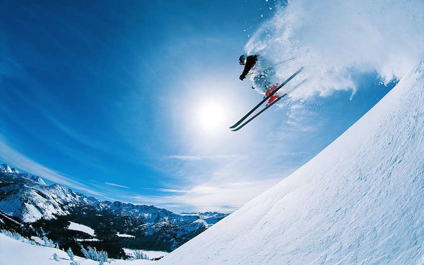

Kol kas tik belenkoks tekstas, viskas yra testuojama naujai

## Pirmas mano pokalbis

1. Naujas Head slidžių komplektas
(slidės, batai, lazdos, šalmas)	50 €
(visai kelionei)	80 €
(7–10 dienų)
Naujas Head snieglentės komplektas
(snieglentė, apkaustai, batai, šalmas)	50 €
(visai kelionei)	80 €
(7–10 dienų)
Nauji inventoriaus gabenimo krepšiai
(ant ratukų, lengvai talpina 2 bet kokio tipo slidinėjimo komplektus)	20 €
(visai kelionei)	30 €
(visai kelionei)
Užtrasės/lavinų saugos įranga
(Tracker 2 beeper + K2 probe + K2 shovel)	50 €
(visai kelionei)	60 €
(visai kelionei)
Millet Neo 30 Airbag kuprinė	100 €
(visai kelionei)	100 €
(visai kelionei)
2. Val Di Sole slėnis dolomitinėse alpėse itin pamėgtas dėl didelio saulėtų dienų skaičiaus, geros infrastruktūros ir, žinoma, pasakiškų dolomitinių alpių vaizdų.
3. Val Di Sole slėnis dolomitinėse alpėse itin pamėgtas dėl didelio saulėtų dienų skaičiaus, geros infrastruktūros ir, žinoma, pasakiškų dolomitinių alpių vaizdų. Dėka Folgarida Marileva, Modonna di Campiglio ir Pinzolo kurortus jungiančių 62 keltuvų sistemos, judėti tarp jų galėsite nenusiimant slidžių. Bendras regiono trasų kilometražas –  150 km, kuris pasidalina į 50 km. mėlynų, 67 km. raudonų ir 33 km. juodų trasų. Val di Sole itin populiarus šeimų tarpe, kadangi čia gausu slidinėjimo mokyklų, slidinėjimo parkų patiems mažiausiems, o apgalvota infrastruktūra tarp kurortų susisiekti patogiai leidžia ir su mažaisiais slidininkais.