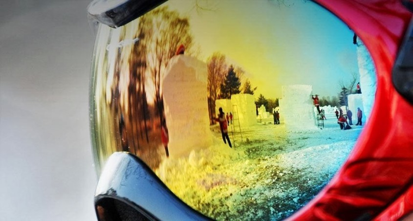

Kol kas tik belenkoks tekstas, viskas yra testuojama naujai

## trecias mano bloko testavimas

Kaip išsirinkti tinkamus slidinėjimo akinius?

Slidinėjimo akiniai (goglai) yra viena svarbiausių įrangos dalių – tokie pat svarbūs kaip kelnės ir striukė, nors dauguma žmonių linkę nuvertinti jų svarbą. Kiekvienas kalnuose kojas apšilęs (ar apšalęs?..) slidininkas ar snieglentininkas tai patvirtins: negalėjimas gerai matyti gali lengvai sugadinti visą dieną lygiai kaip netinkamo dydžio batai arba prastas dešrainis. Tiesa, bet kokie slidinėjimui pritaikyti akiniai kažkiek apsaugos nuo vėjo ir šalčio. Tačiau perkant tokį asmeninį daiktą, kurį vešiesi pažiūrėti kalnų, reikia atidžiai skaityti, kas rašoma etiketėje. Jose labai aiškiai įvardinti techninė jūsų pirkinio pusė: lęšio tipas, lęšio spalva ir tonas, lęšio keitimo galimybės, rėmo dydis ir kiti svarbūs aspektai.
